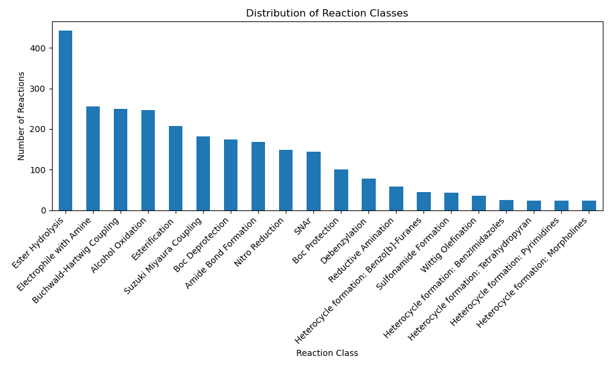

## Reaction Classifier For Top 20 MedChem Reactions

Cleaning reaction data for dataset curation is a challenging process, and many attempts have been made to develop workflows for cleaning reaction data for use in a range of prediction models. Furthermore, reaction classification is essential for grouping chemical reactions to enable prediction models to be built, facilitating both general reactivity models and those specific to a given reaction type.

These things considered, this project provides python code suitable for cleaning chemical reaction data and returning the reaction classes for the top 20 MedChem reactions as per Brown and Coworkers (_J. Med. Chem. 2016, 59, 10, 4443–4458_). The project code is designed to work with Reaxys data, but other data can be substituted, as long as it is in the form of a ".csv" file with the following columns:

*   "Reaction" (str) column containing reaction SMILES,
    
*   "Reagent" (str) column containing reagents
    
*   "Yield" (str) column containing reaction yields (reactions with multiple products should have yields separated with ";").
    

**N.B:** This project has only been tested on a Ubuntu Linux (64-bit) operating system.

## How to install:

The project requires [Conda](https://docs.conda.io/en/latest/) or [Miniconda](https://docs.conda.io/en/latest/miniconda.html) to handle creation of two python environments (two environments are required due to dependency clashes). Miniconda is a lightweight version of Anaconda and is recommended for most users.

### 1\. Download Miniconda

Go to the Miniconda download page and choose the installer for your operating system (Linux, macOS, or Windows).

For example, to download Miniconda for Linux (64-bit):

```bash
wget [https://repo.anaconda.com/miniconda/Miniconda3-latest-Linux-x86\_64.sh](https://repo.anaconda.com/miniconda/Miniconda3-latest-Linux-x86_64.sh%7D)

```

### 2\. Clone the repository

Navigate to the directory you would like to store this projects code in the terminal and enter:

```bash
git clone 
&& cd ReactionClassifier

```

### 3\. Run ReactionClassifier.py on your dataset

Activate the base conda environment by typing

```bash
conda activate

```

Then run ReactionClassifier.py:

```bash
python ReactionClassifier.py -i "your/input/file/here.csv" -o "output/file/destination/and/name.csv"

```

**N.B: If the conda environments (rxnmapper-env and rxn-utils-env) are not already created, then running ReactionClassifier.py will automatically create them for you. The conda environments are quite large (~6 GB in total) so make sure you have adequate disk space. If the conda environments have been created in a previous run, creation will be skipped on subsequent runs of ReactionClassifier.py**

### 4\. Analyse the results!

A notebooks folder is provided within the project directory tree. Here you will find reactions\_notebook.ipynb, which you can use to plot the counts of each class of reaction, as well as any other analysis you choose to perform!

Here's an example plot from some Reaxys data taken from the _Organic Process Research & Development_ (OPRD) Journal:

